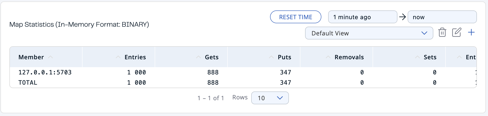

# Hazelcast

## Start/Stop Hazelcast cluster
To start this example use following command:
```bash
./hz.sh start
```

This will start 3 hazelcast nodes on ports 5701, 5702 and 5703. Also, they will receive the configuration from the `hazelcast.xml` file (${PWD}/hazelcast.xml).

To stop the cluster use following command:
```bash
./hz.sh stop
```

This will create a distributed map and write 1000 values to it.
```bash
python write.py
```

This will read 1000 values from the map and write lost values to terminal.
```bash
python read.py
```

## Stop Hazelcast nodes
After writing 1000 values to the map, the hz manager looks like this


It has almost equal number of entries in each node.


Also, there is no lost data (0 lost entries).

Now, let's stop one of the nodes and see what happens.

### Stop 1 node


After stopping one of the nodes, the number of entries in the remaining 2 nodes is redistributed and is also almost equal. Also, there is no lost data.


### Stop 2 nodes consecutively
Now, let's stop the second node and see what happens.




As we can see, the number of entries in the last node is 1000. Also, there is no lost data.


### Stop 2 nodes simultaneously
To do this I've restarted the cluster and stopped 2 nodes simultaneously.


As we can see, the number of entries in the last node is 640. Also, there are 360 lost entries.

### How to prevent
To prevent data loss, we can use the `backup-count` property in the `hazelcast.xml` file. This property specifies the number of synchronous backups. By default, the backup count is 1. If we set it to 2, then the data will be replicated to 2 nodes. So, if 2 nodes are stopped simultaneously, the data will not be lost.

## Simultaneous write without locks
To simulate the simultaneous write without locks, I've created a `write_no_lock.py` script. This script appends 1 to a value in the map 10000 times from 3 different threads. The script is started with the following command:

```bash
./hz.sh start
python write_no_lock.py
```

As we can see, in the result the value is 13082, but it should be 30000. This is because the write operation is not atomic and the threads are not synchronized. They just overwrite each other's values.


## Simultaneous write with pessimistic lock
To simulate the simultaneous write with pessimistic lock, I've created a `write_pess_lock.py` script. This script appends 1 to a value in the map 10000 times from 3 different threads. But this time I call the `lock` method before writing the value and `unlock` method after writing the value. The script is started with the following command:

```bash
./hz.sh start
python write_pess_lock.py
```

As we can see, in the result the value is 30000. This is because before the write operation we lock the map (i.e. no other thread can write to the map at this time) and after the write operation we unlock the map.

It took ~10.69 seconds to write 30000 values to the map.


## Simultaneous write with optimistic lock
To simulate the simultaneous write with optimistic lock, I've created a `write_opt_lock.py` script. This script appends 1 to a value in the map 10000 times from 3 different threads. But this time I try to replace the value in the map only if the value is not changed by another thread. The script is started with the following command:

```bash
./hz.sh start
python write_opt_lock.py
```

As we can see, in the result the value is 30000. This is because the `replace_if_same` method returns `True` only if the value is not changed by another thread.

It took ~9.91 seconds to write 30000 values to the map.


## Conclusion
So, in this task Optimistic Lock is better solution than Pessimistic Lock. It took less time to write 30000 values to the map. Also, it is better than no lock at all, because it guarantees that the value is not changed by another thread.


## Bounded Queue
To create a bounded queue with a capacity of 10, I've created a `bounded_queue.py` script. One thread writes 100 values to the queue one by one and at the same time 2 other threads read values from the queue. The queue is bounded at size 10 in the `hazelcast.xml` file. The script is started with the following command:

```bash
./hz.sh start
python bounded_queue.py
```


It looks like the operations are done one by one. Firstly we add a number and then we read it. It might look like it's not due to async behavior of print function.

Also, if we delete readers, the queue will be filled with 10 values and the writer will be blocked until the queue is not full.

